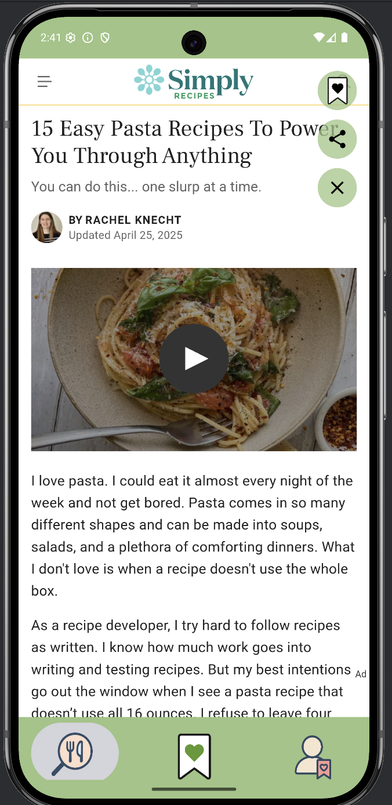
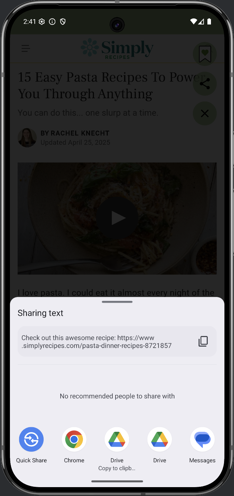
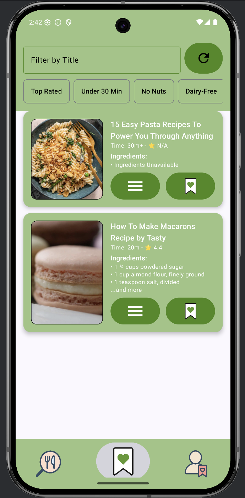
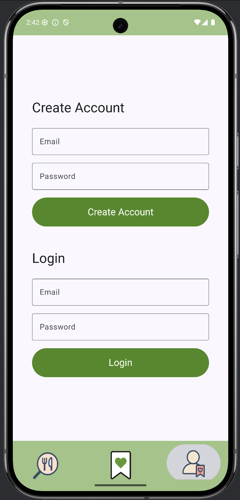

# 🍽️ EZ Eats

A mobile recipe app that helps users find, filter, and save cooking recipes.

## 📚 Course Context

This app was developed as a group project for the course **Mobile App Development** at Pace Univeristy in **Spring 2025**.

## 📱 Features

- 🔍 Search recipes from trusted web sources
- 🧠 Filter and sort results based on ingredients and preferences
- 💾 Save favorite recipes locally
- 🌓 Dark mode support and responsive design
- 🌐 Google Custom Search API + JSoup integration

## 🛠️ Built With

- **Android Studio**
- **Jetpack Compose**
- **Kotlin**
- **JSoup** for HTML parsing
- **Google Custom Search Engine**
- **AWS DynamoDB** (for cloud-based saving)
- **Room Database** (for local storage)
  
### 👥 Team Members & Roles
**Yineiry** – Tester / Frontend Developer  
Worked on frontend UI components and performed comprehensive app testing.  

**Younes** – Backend Programmer  
Handled backend logic and systems development for the app.  

**Dominick** – Image/Asset Finder  
Collected and organized all images and visual assets for the UI.  

**Daniella** – App Designer  
Designed the overall app layout and assisted with debugging.  

## 📸 Screenshots

### 🔍 Search Page

### 🍽️ Recipe View Page

### 📤 Share Page

### 📚 Bookmarks Page

### 👤 Account Page

